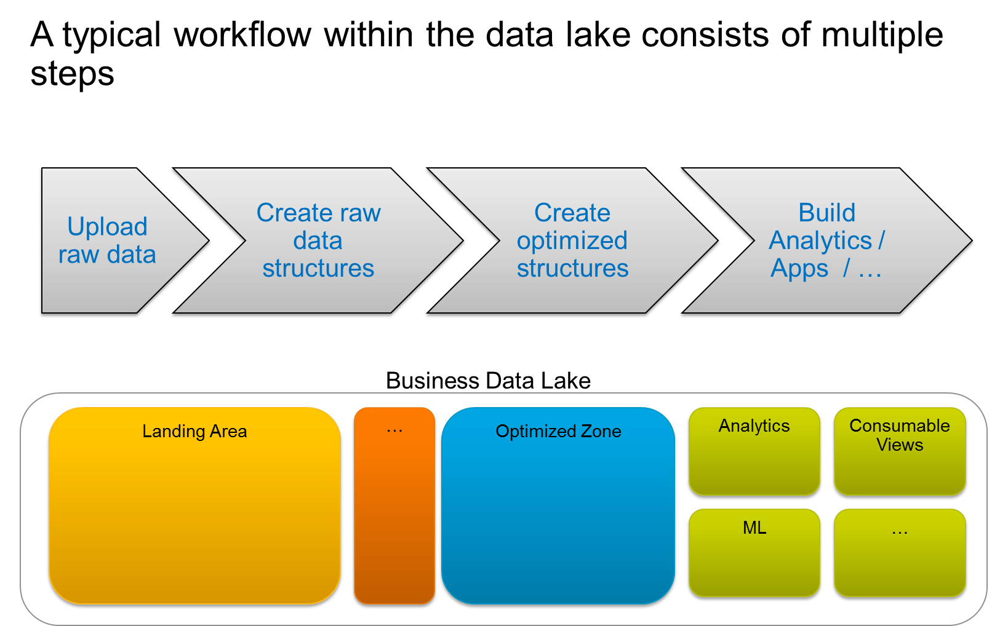

.. bigdata training documentation master file, created by
   sphinx-quickstart on Mon Jan 09 16:03:53 2017.
   You can adapt this file completely to your liking, but it should at least
   contain the root `toctree` directive.

Welcome to bigdata trainings documentation!
========================================================================

*******
Welcome
*******
This is a short documentation for the big data training. Here we'll walk through a simple project to demonstrate the principle of working with a data lake

.. toctree::
   :maxdepth: 2
   
   sql_clients

Indices and tables
==================

* :ref:`genindex`
* :ref:`modindex`
* :ref:`search`
