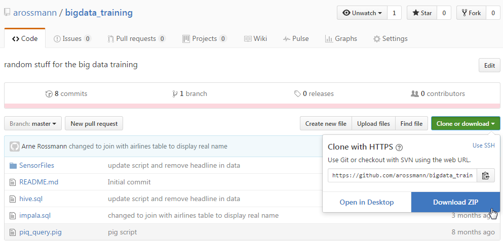

Loading of data
===============

*******************
downloading of data
*******************
* download the files from github:

* unzip the file
* open Hue
* go to the file manager
* create two directories:

    - HVAC
    - building

* upload the appropriate files to the directories:

    - SensorFiles/HVAC.csv --> HVAC
    - SensorFiles/building.csv --> building