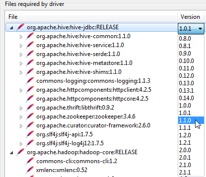

Installation of SQL Clients
===========================

*********
Downloads
*********
Please download one of the following SQL clients:

* `SQuirreL SQL Client <http://squirrel-sql.sourceforge.net/>`_.
* `DBeaver <http://dbeaver.jkiss.org/download/>`_.

*******************
Adding Hive library
*******************

The following instructions are documented with DBeaver. For SquirrelSQL, the steps are similar.

* download the following jar file: `Hive JDBC Jar <http://repo.hortonworks.com/content/repositories/releases/org/apache/hive/hive-jdbc/1.2.1000.2.4.2.0-258/hive-jdbc-1.2.1000.2.4.2.0-258-standalone.jar>`_.
* open DBeaver
* click on Database > Driver manager 

.. image:: _static/dbeaver_driver_manager.png

* Edit the 'Apache Hive' driver

.. image:: _static/dbeaver_drivermanager_Hive.png

* click on org.apache.hive:hive-jdbc and then the "Download/Update" button

.. image:: _static/dbeaver_edit_Hive.png

* Select the Version 1.1.0

* select the Driver Class

